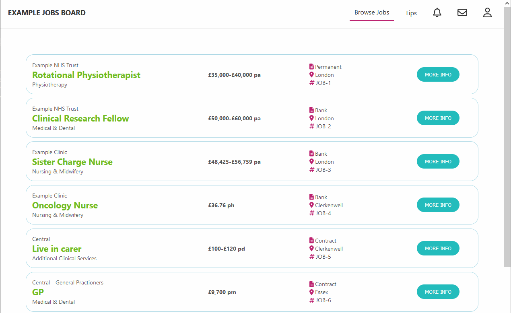

# An Example Jobs Board

A simple page showcasing an example jobs board.

It uses a show and hide animations to provide more information about each role.

## Live site

You can see the page in action here: [https://leepenney.github.io/react-jobs-board-example/](https://leepenney.github.io/react-jobs-board-example/)

## Technologies

Created using the React framework (v17)

## To do

I plan to add some additional front-end features such as filtering and sorting
